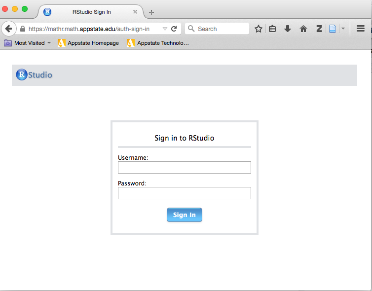

**Instructor:**  Dr. Alan T. Arnholt    
**Office:** Walker Hall 340      
**Office Hours:** 4:15-5:45 Tuesday, 4:15-5:45 Thursday, 12:15-1:45 Friday

Make an appointment to see me by clicking https://arnholtat.youcanbook.me/.

All questions related to the class should be asked by creating a post on [piazza](https://piazza.com/class/iaawd0uzg2193).  If you send me a class related email, I will remind you to post class related questions on piazza.

**Teaching Assistants:** 

* Holly Bernesser --- Math Lab (Walker Hall 105) Tue & Wed 5:45-8:45
* Kyra Patel --- Math Lab (Walker Hall 105) TBD
* Alexa Smith --- Math Lab (Walker Hall 105) Mon & Trs 5:45-8:45

**Not TA but excellent Resource** 
* Erin Kreiling --- Math Lab (Walker Hall 105) Mon, Wed, Trs 5:45-8:00

**Course Description:**  

This course covers data management; descriptive statistics; inferential statistics, including testing one and two sample procedures; ANOVA;  Chi-Square tests; simple regression; and multiple regression.  All of the topics will be  addressed through a student selected research question that will be answered  using one of [six large data sets](https://github.com/alanarnholt/PDS/tree/master/inst/CodeBooks).

**Course Objectives:**

1.  Students will learn to use a reproducible research work flow.
2.  Students will improve their technology expertise.
3.  Students will learn to work with large data sets.
4.  Students will learn to create and present graphs for both univariate and multivariate data.
5.  Students will learn how to construct and test hypotheses.

**Course Text:**

The course will rely primarily on the text [_Passion Driven Statistics (Light Weight)_](https://github.com/alanarnholt/PDS-Book) also available on [Rpubs](http://rpubs.com/arnholt/97944). Students may find the excellent text [_Reproducible Research with R and RStudio, Second Edition_](http://christophergandrud.github.io/RepResR-RStudio/) by Christopher Gandrud helpful.

**Course Grading:**

50% of the course grade will come from 9 peer graded assignments submitted via [CrowdGrader](http://www.crowdgrader.org/). Your grade for a peer evaluated assignment will be a combination of peer evaluations and an evaluation of your peer grading. The algorithm used to compute your grade is explained [in this presentation](https://docs.google.com/viewer?a=v&pid=sites&srcid=ZGVmYXVsdGRvbWFpbnxjcm93ZGdyYWRlcm9yZ3xneDozNGIxZGI5YjRiMDIzOTU1). Grading rubrics and directions for each assignment are provided in the directory `CoursePacing` of the class repository.  15% of the course grade will come from your **Research Proposal**;  15% of the course grade will be for a poster each student will create and present December 1, 2015, in the Plemmons Student Union.  The remaining 20% of the course grade will be for participation, largely tracked in [piazza](https://piazza.com/class/iaawd0uzg2193).  The participation tracked in piazza includes questions asked on the forum, questions answered on the forum, etc.  25% of the participation grade will be for the completion of a pre-course and post-course survey.  If you know you will be absent at any point in the semester for any reason, please let me know beforehand; and make sure to submit your work via [CrowdGrader](http://www.crowdgrader.org/) before the due date.  Each time you come to class, you should hand me a 3 by 5 index card before sitting down with your first and last name in the top left, the date in year-month-day format (2015-09-03) in the top right, with at least one question you have about the assigned material for that day, which will also contribute to your participation grade.       

**How To Get Unstuck**

If you have a class related question, please ask your question on [piazza](https://piazza.com/class/iaawd0uzg2193).  Your classmates may have the same question or may answer your question before either a TA or I can provide an answer.  Well constructed questions will elicit answers more rapidly than poorly constructed questions.  This [video](https://www.youtube.com/watch?v=ZFaWxxzouCY&list=PLjTlxb-wKvXNSDfcKPFH2gzHGyjpeCZmJ&index=3) provides some background on asking questions.  This stackoverflow thread details how to create a [minimal R reproducible example](http://stackoverflow.com/questions/5963269/how-to-make-a-great-r-reproducible-example/5963610#5963610). Please read [How To Ask Questions The Smart Way](http://www.catb.org/~esr/faqs/smart-questions.html) by Eric Raymond and Rick Moen and heed their advice.

**University Policies**

This course conforms with all Appalachian State University policies with respect to academic integrity, disability services, and class attendance.  The details of the policies may be found at <http://academicaffairs.appstate.edu/resources/syllabi>.

**Typical Class Period**

The first 30% of class will generally be lecture-oriented, where I will present material to supplement the reading and video assignments.  To maximize your understanding of the lecture portion of class, please read the material assigned and watch the videos assigned before coming to class.  The next 60% of the class, students will work on their individual projects. The last 10% of class will generally be a review of the material covered that day and a preview of the next class.  

**Computers and Software**

This course will use the RStudio server  (https://mathr.math.appstate.edu/) that has the programs listed below and more installed.

* [R](http://cran.r-project.org) 
* [Git](http://git-scm.com/downloads) 
* [RStudio](http://www.rstudio.com/products/rstudio/download/)
* [LaTeX](http://www.ctan.org/starter)

You must have an active internet connection and be registered in the course to access the server. To access the server, point any web browser to <https://mathr.math.appstate.edu/>.  You will need to acknowledge the connection is unsecure and possibly add a security exception to your web browser. Use your Appstate Username and Password to access the server.  A screen shot of the RStudio server is shown below.

If you have problems with your Appstate Username or Password visit [IT Support Services](http://support.appstate.edu/) or call 262-6266.  

